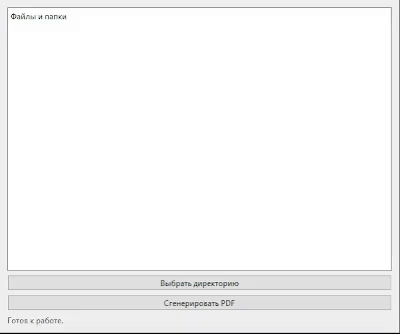
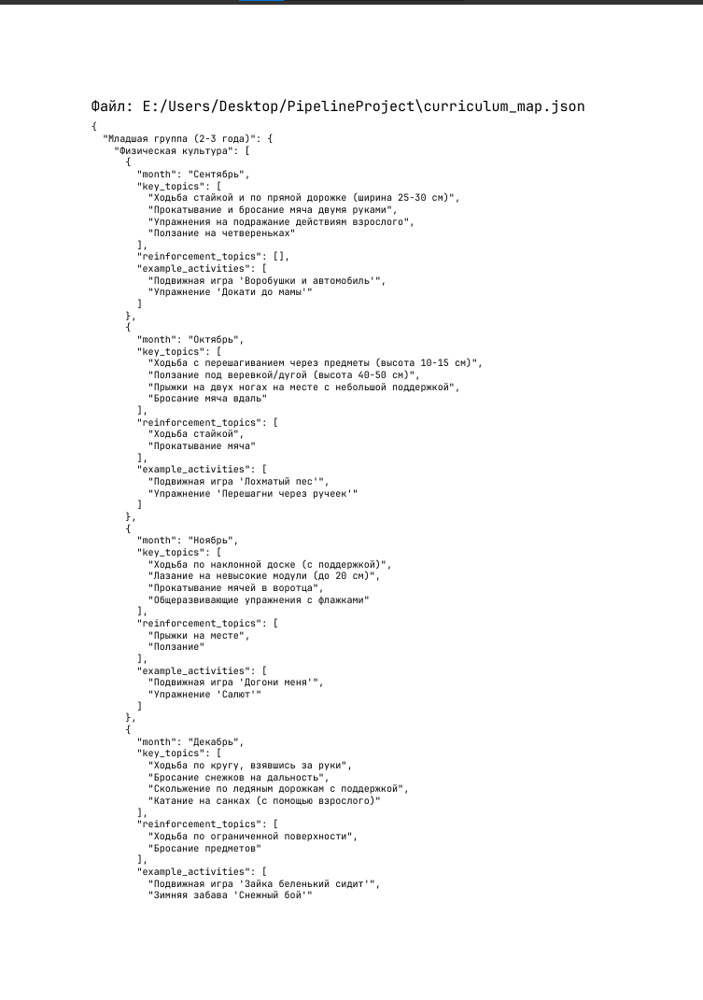

# Source Snapshot

Утилита для создания профессиональных PDF-отчетов из исходного кода проекта. Позволяет быстро и удобно упаковать выбранные файлы и директории в единый, читаемый документ для код-ревью, архивации или демонстрации.



## Основные возможности

*   **Графический интерфейс:** Интуитивно понятное приложение на базе `PyQt6` с древовидной структурой для выбора файлов.
*   **Многопоточная обработка:** Генерация отчета происходит в фоновом потоке, что гарантирует отзывчивость интерфейса даже при обработке больших проектов.
*   **Интеллектуальное чтение файлов:**
    *   Автоматическое определение и корректная обработка текстовых кодировок (`UTF-8`, `UTF-16`, `cp1251`).
    *   Безопасное игнорирование бинарных файлов и служебных директорий (`.git`, `__pycache__`, `node_modules` и др.).
    *   Защита от зависаний путем пропуска файлов, превышающих установленный лимит (10 МБ).
*   **Профессиональный результат:** Итоговый PDF-документ использует моноширинный шрифт `JetBrains Mono` для оптимального отображения кода и сохраняет его форматирование.
*   **Полный контроль:** Пользователь самостоятельно выбирает место сохранения и имя для итогового отчета.

## Пример результата




## Как использовать

### Вариант 1: Запуск из исходного кода

1.  Клонируйте репозиторий:
    ```bash
    git clone https://github.com/MadiZhakenov/source-snapshot.git
    cd source-snapshot
    ```

2.  Установите необходимые зависимости:
    ```bash
    pip install -r requirements.txt
    ```

3.  Запустите приложение:
    ```bash
    python src/main.py
    ```

### Вариант 2: Использование готового приложения (EXE)

1.  Перейдите в раздел **[Releases](https://github.com/MadiZhakenov/source-snapshot/releases)** на странице репозитория.
2.  Скачайте последнюю версию `Source_Snapshot.exe`.
3.  Запустите файл. Установка не требуется.

## Зависимости

*   PyQt6
*   ReportLab